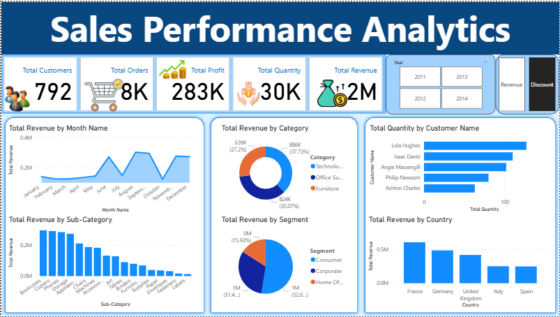
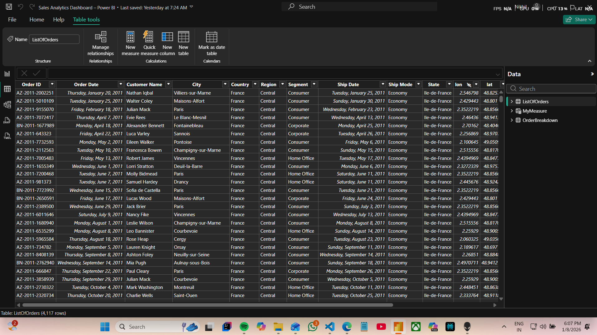

# Sales Analytics Dashboard using Power BI

## Overview
This project presents an interactive Sales Analytics Dashboard built using Microsoft Power BI.  
The dashboard provides insights into sales performance across regions, product categories, and time periods, enabling data-driven analysis and decision-making.

## Dashboard Preview

## Tools Used
- Microsoft Power BI
- Microsoft Excel

## Key Features
- Key performance indicators (Sales, Profit, Quantity, Orders)
- Region-wise and category-wise sales analysis
- Monthly sales trend visualization
- Interactive filters for dynamic data exploration

## Data Preparation
The raw sales dataset was cleaned and transformed using Power Query before building the dashboard.  
This included handling data types, renaming columns, and preparing the data for analysis.
The dataset has ~500 rows of sales transactions with columns like OrderDate, Region, Category, Sales, Profit.

## Project Context
This dashboard was initially created as part of guided learning and later refined, structured, and documented independently for portfolio use.

## Project Status
Completed.  
Future enhancements may include advanced DAX measures and deeper customer-level analysis.

## Author
**Nikhil**
